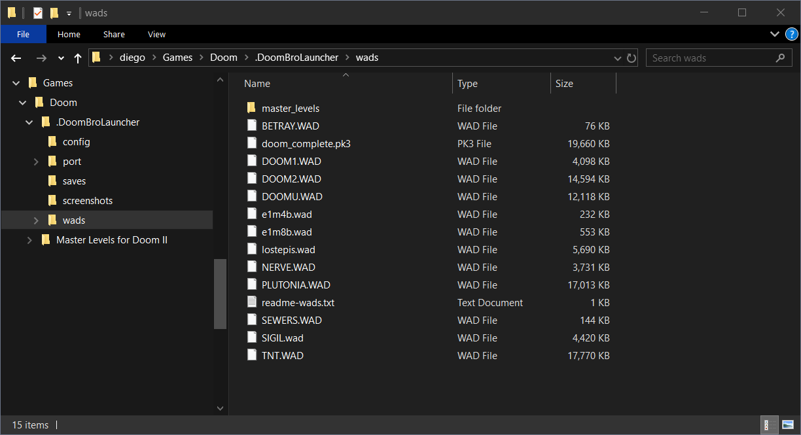
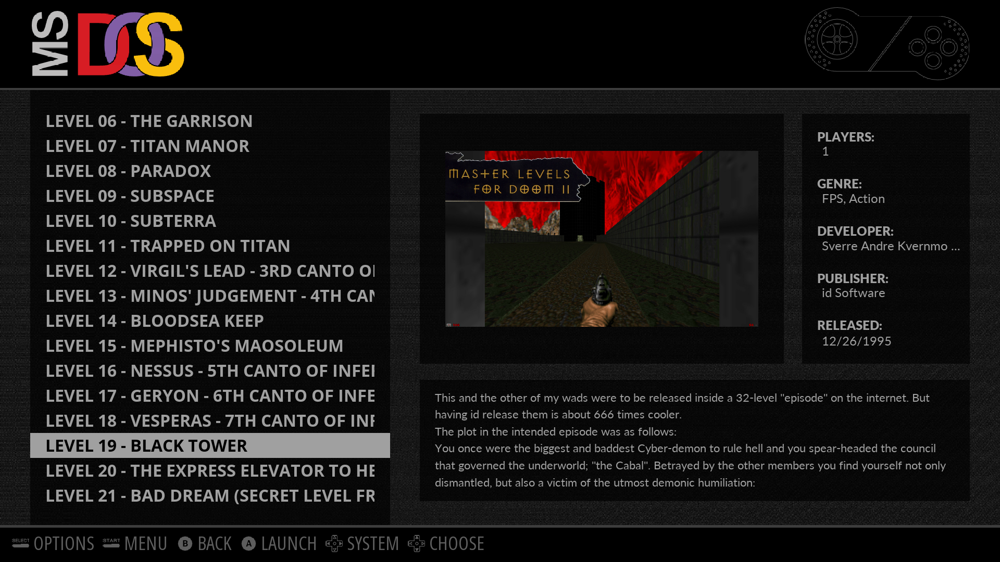

# DoomBroLauncher
A preconfigured launcher for Doom classic games, fully compatible with Xbox controllers for Windows PCs using [GZDoom Source Port](https://zdoom.org/index).

Our goal is to propose an organized way to execute Doom Classic games using GZDoom Source Engine. Taking advantage of its [command line parameters](https://zdoom.org/wiki/Command_line_parameters) we can set custom saves, screenshots and configuration paths in order to make it more portable and easy to update. Also, as part of an [HTPC](https://en.wikipedia.org/wiki/Home_theater_PC) experience on Windows, we preconfigured a settings file to fully work with XInput devices, including [Xbox 360 controllers](https://en.wikipedia.org/wiki/Xbox_360_controller), [Xbox One controllers](https://en.wikipedia.org/wiki/Xbox_One_controller), or similar controllers.

First release is focused for Windows systems, a Linux version is planned for the future.

---
# Table of Contents
<ol>
	<li>
		<a href="#1-motivation">Motivation</a>
	</li>
	<li>
		<a href="#2-what-makes-this-launcher-different-than-others-of-the-same-kind">What makes this launcher different than others of the same kind?</a>
	</li>
	<li>
		<a href="#3-usage">Usage</a>
	</li>
	<li>
		<a href="#4-installation">Installation</a>
		<ol>
			<li>
				<a href="#41-prerequisites">Prerequisites</a>
				<ol>
					<li>
						<a href="#411-doom-i-shareware">Doom I (Shareware)</a>
					</li>
					<li>
						<a href="#412-the-ultimate-doom">The Ultimate Doom</a>
					</li>
					<li>
						<a href="#413-doom-ii">Doom II</a>
					</li>
					<li>
						<a href="#414-master-levels-for-doom-ii">Master Levels for Doom II</a>
					</li>
					<li>
						<a href="#415-final-doom">Final Doom</a>
					</li>
					<li>
						<a href="#416-officially-released-levels">Officially released levels</a>
						<ol>
							<li>
								<a href="#4161-sewers-and-betray-levels">&quot;Sewers&quot; and &quot;Betray&quot; levels</a>
							</li>
							<li>
								<a href="#4162-no-rest-for-the-living-episode">&quot;No Rest for the Living&quot; episode</a>
							</li>
						</ol>
					</li>
					<li>
						<a href="#417-semi-official-levels">Semi-official levels</a>
						<ol>
							<li>
								<a href="#4171-the-lost-episode">&quot;The Lost Episode&quot;</a>
							</li>
							<li>
								<a href="#4172-john-romeros-levels">John Romero's levels</a>
							</li>
							<li>
								<a href="#4173-john-romeros-sigil">John Romero's SIGIL</a>
							</li>
						</ol>
					</li>
					<li>
						<a href="#418-using-wadsmoosh-to-create-doom-complete-compilation">Using WadSmoosh to create &quot;Doom Complete&quot; compilation</a>
					</li>
				</ol>
			</li>
			<li>
				<a href="#42-steps-to-install-the-doombrolauncher">Steps to install the DoomBroLauncher</a>
			</li>
		</ol>
	</li>
	<li>
		<a href="#5-details-of-preconfigured-settings">Details of preconfigured settings</a>
		<ol>
			<li>
				<a href="#51-game-settings">Game Settings</a>
			</li>
			<li>
				<a href="#52-controller-settings">Controller Settings</a>
			</li>
			<li>
				<a href="#53-preconfigured-controller-bindings-for-xinput-devices-xbox-360-or-xbox-one-controllers">Preconfigured controller bindings for XInput devices (Xbox 360 or Xbox One controllers)</a>
				<ol>
					<li>
						<a href="#531-xbox-360-and-xbox-one-key-bindings">Xbox 360 and Xbox One key bindings</a>
					</li>
				</ol>
			</li>
		</ol>
	</li>
	<li>
		<a href="#6-advanced-configuration-optional">Advanced Configuration</a>
		<ol>
			<li>
				<a href="#61-create-more-batch-scripts-to-run-new-doom-games-or-mods">Create more batch-scripts to run new Doom games or mods</a>
				<ol>
					<li>
						<a href="#611-create-an-script-for-an-iwad-complete-games">Create an script for an IWAD (complete games)</a>
					</li>
					<li>
						<a href="#612-create-an-script-for-a-pwad-a-mod-for-a-game">Create an script for a PWAD</a>
					</li>
				</ol>
			</li>
			<li>
				<a href="#62-changing-the-game-skill-difficulty">Changing the Game Skill (difficulty)</a>
			</li>
			<li>
				<a href="#63-integration-with-emulationstation">Integration with EmulationStation</a>
			</li>
		</ol>
	</li>
</ol>

---

## 1. Motivation
The original idea came when one of my best friends asked me for a good source port to run his old Doom games, he needed something easy to execute, so I created this launcher for him using scripts to call GZDoom, a source port that provides a very good compatibility with games and mods and can enhance the graphics without compromising the original look and feel experience.

So I ended up with a set of batch scripts and folders in certain order so they can be portable and easy to execute. Each Doom game will be represented by their own batch script created based on a template, so the user just need to double click the batch of the game to launch it. Since GZDoom puts the saves, configurations and screenshots files on its root folder (in order to be portable), it can be a problem for people that cannot recognize these files when they try to update the GZDoom software, they can override configurations or delete saves if they are not careful. So to reduce that risk there are different folders: A folder for configurations, a folder for saves, a folder for screenshots and a folder for port binaries. The batch scripts knows the location of these folders thanks to some special [command line parameters](https://zdoom.org/wiki/Command_line_parameters). So, if you want to update GZDoom binaries, you just need to delete the contents of the `Doom/.DoomBroLauncher/port` folder, and then unzip the new ones on it.

I've been working with [Kodi and EmulationStation](https://github.com/BrosMakingSoftware/Kodi-Launches-EmulationStation-Addon) configuring my own HTPC Windows machine and I noticed that the batch-scripts approach of having one script for each game fits very nice with the way how EmulationStation lists and executes roms. Originally to execute Doom games from EmulationStation you need to configure it to filter wads and build an execution line where you call the source port with the wad as parameter, the confusion starts when the wad you want to run is actually a mod (PWAD) so you need a way to define its respective IWAD, which means definitely another way to run the games, so relying this responsibility to batch scripts is the most portable and easy to maintain idea. This is similar to the solution provided for [Retropie](https://github.com/retropie/retropie-setup/wiki/Doom) but a little less complex. Also since this works with EmulationStation, it was a good idea to preconfigure a settings file to work with XInput devices (Xbox controllers), so we can navigate in Kodi and EmulationStation and play Doom games with a controller from the couch.

## 2. What makes this launcher different than others of the same kind?
- Completely open source, hosted on [GitHub](https://github.com/BrosMakingSoftware/DoomBroLauncher) and published under GPL v3 license
- A preconfigured settings file is provided which enables Xbox controllers with an [intuitive layout](#531-xbox-360-and-xbox-one-key-bindings) and a display resolution of 1920x1080 (Full HD) in full screen, also including some tweaks on the [map display](#51-game-settings) (all of them detailed below in this documentation)
- The usage of Xbox controllers is optional, the game can still be played with keyboard and mouse
- Each Doom game is called by individual batch scripts that have a descriptive name and you don't need to enter additional prompts, just run the scripts by double clicking them or calling them from a command line
- Batch scripts are the native and fastest way to start a program and they are easy to maintain. Other launchers use another scripting languages which means you need an external runtime that not all users may have installed, or they use compiled executables which are harder to edit than a simple `.bat` file. At the end this is just a launcher, let's keep it simple
- Lightweight scripts, about 50 KB all of them!
- New batch scripts with more Doom games or mods are [easy to add](#61-create-more-batch-scripts-to-run-new-doom-games-or-mods). They reuse common variables defined in a single file which means that any change is reflected on all scripts (for example addition of new parameters)
- Includes scripts to run the `Master Levels for Doom II` with 2 different orders (PC and PSN), without the need to edit TEETH.WAD levels
- Only open source code or programs are used by this project, including the source-port
- Easy to integrate with EmulationStation: Boxarts, metadata and [documentation](#63-integration-with-emulationstation) is provided below.

## 3. Usage
Use this launcher to start Doom Classic games and don't worry about complicated source ports configurations, just copy your games on the wads path and you are ready to play them by running the batch file with the name of your game.

**Notes:**  
This project is a launcher, so the installation of a source port is required (in this case GZDoom), installation instructions are easy and provided below. Games (or `.wad` files) are not provided here, you need to provide them. If you don't own the games, read the prerequisites section to find where you can buy the commercially distributed ones, and where you can download the free ones.

## 4. Installation

#### 4.1. Prerequisites
This release of the launcher is focused for Windows. You must know if your Windows system is 32 bits or 64 bits, check instructions [here](https://support.microsoft.com/en-us/help/827218/how-to-determine-whether-a-computer-is-running-a-32-bit-version-or-64-bit-version-of-the-windows-operating-system), you will need this later.

Also, you need [Doom wads](https://en.wikipedia.org/wiki/Doom_WAD) which have the game data, they are not included with DoomBroLauncher because some of them are commercially distributed and others are not compatible with DoomBroLauncher's GPL license, but we can list the places where you can buy or download them:

##### 4.1.1. Doom I (Shareware)
This shareware contains the first episode of Doom I.  
Latest version of the shareware is v1.9, download it from https://www.doomworld.com/idgames/idstuff/doom/doom19s.

Lower versions can be downloaded from [doomworld.com](https://www.doomworld.com/idgames//index.php?search=1&field=title&word=shareware&sort=time&order=asc&page=1) or [archive.org](https://archive.org/details/DoomsharewareEpisode).

##### 4.1.2. The Ultimate Doom
This is the complete version of Doom I and it is commercially distributed:
* You can buy the game directly from [Steam](https://store.steampowered.com/sub/18397) or [GOG](https://www.gog.com/game/the_ultimate_doom).
* You can buy *Doom 3: BFG Edition* from [Steam](https://store.steampowered.com/app/208200/Doom_3_BFG_Edition/) or [GOG](https://www.gog.com/game/doom_3_bfg_edition), it comes with copies of the classic *Ultimate Doom* and *Doom II*. These versions come with Steam/GOG Achievements, which is a nice feature to have if you plan to play them from the *Doom 3: BFG Edition* launcher, but keep in mind that these classic versions are modified: The red cross symbols on all types of medical kits where replaced by pills (due to an infringement complaint from the Red Cross), and Wolfenstein's secret levels were censored. So this can be an issue for people looking for the original experience. Besides that, the games remains the same and can be used to load mods as well.

##### 4.1.3. Doom II
Doom II is commercially distributed:
* You can buy the game directly from [Steam](https://store.steampowered.com/sub/18397) or [GOG](https://www.gog.com/game/doom_ii_final_doom).
* You can buy *Doom 3: BFG Edition* from [Steam](https://store.steampowered.com/app/208200/Doom_3_BFG_Edition/) or [GOG](https://www.gog.com/game/doom_3_bfg_edition), it comes with copies of the classic *Ultimate Doom* and *Doom II*. As previously mentioned, these are modified versions.

##### 4.1.4. Master Levels for Doom II
Master Levels for Doom II is an expansion for Doom II, it is commercially distributed as a bundle with Doom II:
* You can buy the bundle from [Steam](https://store.steampowered.com/sub/18397) or [GOG](https://www.gog.com/game/doom_ii_final_doom).

##### 4.1.5. Final Doom
Final Doom introduces *TNT Evilution* and *Plutonia Experiment* episodes as sequels of Doom II. They are not expansions, but stand alone games. They are commercially distributed:
* You can buy the game directly from [Steam](https://store.steampowered.com/sub/18397) or [GOG](https://www.gog.com/game/doom_ii_final_doom).

##### 4.1.6. Officially released levels
Here we are going to list levels that don't belong to the original games, but they were officially added by [id Software](https://en.wikipedia.org/wiki/Id_Software) (or authorized publishers) on re-releases.

###### 4.1.6.1. "Sewers" and "Betray" levels
[Sewers](https://doom.fandom.com/wiki/E1M10:_Sewers_%28Xbox_Doom%29) for Ultimate Doom, and [Betray](https://doom.fandom.com/wiki/MAP33:_Betray_%28Xbox_Doom_II%29) for Doom II are exclusive levels of the [Xbox](https://en.wikipedia.org/wiki/Xbox_%28console%29) ports of [Doom 3 Limited Collector's Edition](https://doom.fandom.com/wiki/Doom_3#Xbox_port) (first appearance) and later on [Doom 3 Resurrection of Evil](https://en.wikipedia.org/wiki/Doom_3:_Resurrection_of_Evil).

The levels were commercially distributed on [Xbox](https://en.wikipedia.org/wiki/Xbox_%28console%29) only, but you can download a free bug-fixed PC version of these levels at http://www.classicdoom.com/xboxspec.htm.

###### 4.1.6.2. "No Rest for the Living" episode
[No Rest for the Living](https://doom.fandom.com/wiki/No_Rest_for_the_Living) is an expansion for Doom II, adding a second episode. It was bundled with Doom II and sold on [Xbox Live Arcade](https://en.wikipedia.org/wiki/Xbox_Live_Arcade) for the Xbox 360 (first appearance), and later on [Doom 3 BFG Edition](https://en.wikipedia.org/wiki/Doom_3:_BFG_Edition).

It is commercially distributed:
* You can buy it on the [Xbox Live Arcade (now called Xbox Marketplace)](https://marketplace.xbox.com/en-US/Product/DOOM-II/66acd000-77fe-1000-9115-d802584109b6).
* You can buy *Doom 3: BFG Edition* from [Steam](https://store.steampowered.com/app/208200/Doom_3_BFG_Edition/) or [GOG](https://www.gog.com/game/doom_3_bfg_edition). We recommend to buy it for PC since the wads files are easier to access than in consoles.

##### 4.1.7. Semi-official levels
###### 4.1.7.1. "The Lost Episode"
[The Lost Episode](https://doom.fandom.com/wiki/Doom:_The_Lost_Episode) is a mod for *Ultimate Doom*, adding a fifth episode including remastered versions of levels only seen on [Doom Alphas](https://doom.fandom.com/wiki/Alpha), [Jaguar's Doom](https://doom.fandom.com/wiki/Atari_Jaguar), and [PlayStation 1's Doom](https://doom.fandom.com/wiki/Sony_PlayStation). The original levels were never released on PC, but the team behind this project did an excellent job by recreating the levels maintaining the original flow, look and feel and made them playable on PC. From our stand point, this episode should be considered as official, since original designs came from official releases from [id Software](https://en.wikipedia.org/wiki/Id_Software), even when the port was made by an independent team.

Download it free at https://www.doomworld.com/idgames/levels/doom/Ports/j-l/lostepis

###### 4.1.7.2. John Romero's levels
[John Romero](https://en.wikipedia.org/wiki/John_Romero) was one of the co-founder of [id Software](https://en.wikipedia.org/wiki/Id_Software), and he was the designer of many of their games, including Doom I and Doom II.

Doom I Episode 1 has two levels not designed by John Romero, so he remake them because he wanted to create an episode consisting only of his own work.

The levels are:
* [Phobos Mission Control](https://doom.fandom.com/wiki/Phobos_Mission_Control) (E1M4b): Download it free at https://twitter.com/romero/status/725032002244759552
* [Tech Gone Bad](https://doom.fandom.com/wiki/Tech_Gone_Bad) (E1M8b): Download it free at https://twitter.com/romero/status/688054778790834176

We think these levels should be considered as official alternative scenarios, because even when [id Software](https://en.wikipedia.org/wiki/Id_Software) did not release them,  they were released by John Romero himself, with ideas he wanted to implement at the time of designing the original games.

###### 4.1.7.3. John Romero's SIGIL
SIGIL is a new 5th episode for the original Doom released by John Romero to celebrate the 25th Anniversary of Doom.  
You can get Sigil by purchasing it at https://www.romerogames.ie/si6il, or you can download the free version from the same site. The difference between both versions is that purchased one includes the soundtrack by [Buckethead](https://en.wikipedia.org/wiki/Buckethead), while the free version includes the MIDI soundtrack by [James Paddock](https://doomwiki.org/wiki/James_Paddock_%28Jimmy%29).

##### 4.1.8. Using WadSmoosh to create "Doom Complete" compilation
[WadSmoosh](https://jp.itch.io/wadsmoosh) is an excellent tool for merging _Ultimate Doom_ (including "Sewers" level), _Doom II_ (including "Betray" level), _No Rest for the Living_ episode for Doom II, _Master Levels for Doom II_, _Final Doom_ and _Sigil_ into one single IWAD file. It only works with strictly official releases and creates a `.pk3` file.

We highly recommend to create this _Doom Complete_ compilation as it provides a smooth experience, it organizes _The Master Levels for Doom II_ as one single episode and it places the secret exit switches to go to _Sewers_ and _Betray_ levels. For more information, check the [project's web page](https://jp.itch.io/wadsmoosh), and their [forum thread](https://forum.zdoom.org/viewtopic.php?f=19&t=52757).

---

#### 4.2. Steps to install the DoomBroLauncher
1. Download DoomBroLauncher:   
   To download the launcher, go to https://github.com/BrosMakingSoftware/DoomBroLauncher/releases and download the latest zip file available.

2. Unzip DoomBroLauncher:   
   Unzip the DoomBroLauncher zip in a folder on your system. For example, I'm going to create a folder called `Games` under my home folder on Windows (`C:\Users\diego\Games\`, or `%HOMEPATH%\Games`) and I will unzip all the contents on that folder. Its root folder is called `Doom`, and it has a subfolder called `Doom/.DoomBroLauncher`, where you can find more folders where configuration files are stored.

   Check the folder structure in this image:
   

	 `Master Levels for Doom II` has 2 folders with one set of scripts each one, one representing the _PC Release order_ and another one with the _PSN Release order_.

3. Download GZDoom:    
   To download **GZDoom**, go to https://zdoom.org/downloads and select the version that matches your Windows system (32 bits or 64 bits), this is important since the program will not start on the wrong system version.

   Pick the latest GZDoom version available, you will download a zip file with a name like `gzdoom-bin-X-x-x.zip` for 32 bits, or `gzdoom-bin-X-x-x-x64.zip` for 64 bits, where the `X-x-x` represents the current version of the program, for example `4.1.1`.

   Open the zip file and copy its contents to the `Doom/.DoomBroLauncher/port` folder:
   

4. Now it's time to copy your Doom games:    
   Find your `.wad` files from your copies of Doom (depending of your game, it can be in one place or another, check [this](https://doomwiki.org/wiki/How_to_download_and_run_Doom) for more info), and copy them to the `Doom/.DoomBroLauncher/wads` folder. In the case of `Master Levels for Doom II`, copy all the levels in `Doom/.DoomBroLauncher/wads/master_levels`.

   The existing scripts will expect the following `.wad` names:
   <table style="width:100%">
    <tr>
      <th>Game / Mod</th>
      <th>`.wad` name</th>
    </tr>
    <tr>
      <td>Doom Complete (WadSmoosh pack)</td>
      <td>doom_complete.pk3</td>
    </tr>
    <tr>
      <td>Doom 1 - Shareware</td>
      <td>DOOM1.WAD</td>
    </tr>
    <tr>
      <td>Doom 1 - The Ultimate Doom</td>
      <td>DOOMU.WAD <br/> (you may need to rename this file if its original name is DOOM.WAD)</td>
    </tr>
    <tr>
      <td>Doom 2 - Hell on Earth</td>
      <td>DOOM2.WAD</td>
    </tr>
    <tr>
      <td>Final Doom (1st Episode) - TNT Evilution</td>
      <td>TNT.WAD</td>
    </tr>
    <tr>
      <td>Final Doom (2nd Episode) - Plutonia Experiment</td>
      <td>PLUTONIA.WAD</td>
    </tr>
    <tr>
      <td>
				Master Levels for Doom II
				<br/><br/>
				Note #1: There is no need to modify TEETH.WAD, this launcher works with the original file.
				<br/><br/>
				Note #2: These levels are referenced by 2 sets of scripts divided in folders, one representing the _PC Release order_ (alphabetical order) and _PSN Release order_.
			</td>
      <td>
      	ATTACK.WAD<br/>
      	BLACKTWR.WAD<br/>
      	BLOODSEA.WAD<br/>
      	CANYON.WAD<br/>
      	CATWALK.WAD<br/>
      	COMBINE.WAD<br/>
      	FISTULA.WAD<br/>
      	GARRISON.WAD<br/>
      	GERYON.WAD<br/>
      	MANOR.WAD<br/>
      	MEPHISTO.WAD<br/>
      	MINOS.WAD<br/>
      	NESSUS.WAD<br/>
      	PARADOX.WAD<br/>
      	SUBSPACE.WAD<br/>
      	SUBTERRA.WAD<br/>
      	TEETH.WAD<br/>
      	TTRAP.WAD<br/>
      	VESPERAS.WAD<br/>
      	VIRGIL.WAD<br/>
      </td>
    </tr>
		<tr>
      <td>Mod for Doom 1 - Sewers (Xbox Level) [E3M1]</td>
      <td>SEWERS.WAD</td>
    </tr>
    <tr>
      <td>
				Mod for Doom 1 - Sigil (John Romero's 5th Episode) [E5M1 to E5M9]
				<br/><br/>
				Note #1: There are 4 ways to play Sigil: Free or Purchased versions, and for each of them: Normal or Compatible versions. The priority of loading is determined by the script depending of the files it finds, check the groups listed (from 1 to 4) on the next column.
				<br/><br/>
				Note #2: Purchased versions are defined by the existence of the "SHREDS" files (`SIGIL_SHREDS.wad` for normal version, `SIGIL_SHREDS_COMPAT.wad` for the compatible version).
				<br/><br/>
				Note #3: Compatible versions are focused to not overload the vanilla engines limitations. They are defined by the existence of the "COMPAT" files (`SIGIL_SHREDS_COMPAT.wad` for purchased version, `SIGIL_COMPAT.wad` for the free version). GZDoom is not a vanilla engine since it actually add enhancements to the games and it is able to overpass the original limitations, so it doesn't require these versions.
				<br/><br/>
			</td>
      <td>
				All the following combinations of wads are supported:
				<br/><br/>
				1. Purchased Sigil:<br/>
				SIGIL.wad<br/>
				SIGIL_SHREDS.wad<br/>
				<br/>
				2. Purchased Compatible Sigil:<br/>
				SIGIL_COMPAT.wad<br/>
				SIGIL_SHREDS_COMPAT.wad<br/>
				<br/>
				3. Free Sigil:<br/>
				SIGIL.wad<br/>
				<br/>
				4. Free Compatible Sigil<br/>
				SIGIL_COMPAT.wad
				<br/>
			</td>
    </tr>
		<tr>
      <td>Mod for Doom 1 - Tech Gone Bad (John Romero) [E1M8]</td>
      <td>e1m8b.wad</td>
    </tr>
		<tr>
      <td>Mod for Doom 1 - Phobos Mission Control (John Romero) [E1M4]]</td>
      <td>e1m4b.wad</td>
    </tr>
    <tr>
      <td>Mod for Doom 1 - The Lost Episode (5th Episode) [E5M1 to E5M9]</td>
      <td>lostepis.wad</td>
    </tr>
    <tr>
      <td>Mod for Doom 2 - Betray (Xbox Level) [MAP01]</td>
      <td>BETRAY.WAD</td>
    </tr>
    <tr>
      <td>Mod for Doom 2 - No Rest for the Living (XBLA 2nd Episode) [LEVEL01 to LEVEL09]</td>
      <td>NERVE.WAD</td>
    </tr>
  </table>

  This is how the folder should look like with ALL the wads:
  

  And the `master_levels` folder:
  

5. You are ready to go to the `Doom` folder to select and start the scripts that correspond to the games you copied from the previous step.


## 5. Details of preconfigured settings

### 5.1. Game Settings
- **Always Run** is enabled
- **Automap** &rarr; `Map Color Set` is set to _Traditional Doom_
- **Automap** &rarr; `Rotate Automap` is enabled
- **Automap** &rarr; `Enable Textured Display` is enabled
- **Automap** &rarr; `Show Item Counts` is enabled
- **Automap** &rarr; `Show Monster Counts` is enabled
- **Automap** &rarr; `Show Secrets Counts` is enabled
- **Screen Size** is set to max (`Ctrl -` or `Ctrl +` on keyboard can change this)
- **Display Resolution** is set to `1920x1080p` and full screen

### 5.2. Controller Settings
Joystick usage is enabled for DirectInput, XInput and Raw-PlayStation-2-Adapter controllers.
The property used was `use_joystick=true`.
This will enable the already mentioned Input controllers and loads the default settings for XInputs, in this case joysticks and triggers moves and their deadzones.

#### 5.3. Preconfigured controller bindings for XInput devices (Xbox 360 or Xbox One controllers)
**START** button on controller brings the _Main Menu_ (the same menu displayed using **ESC** key on keyboard).
This binding for some reason is not visible at all on the _Customize Controls_ menu, so it needed to be written on the properties file directly.
The property used was `joy8=menu_main`. To exit the _Main Menu_ press `B` button.

**Right Trigger** is bind to `Attack/Fire`, it can be set on _Customize Controls_ menu, but the key name is not displayed on the list of keys. It should be displayed as `axis5minus`.
The property used was `axis5minus=+attack`.

##### 5.3.1. Xbox 360 and Xbox One key bindings

##### Menu Bindings
`START/MENU` Button &rarr; Main Menu

###### Left Stick (`LS`) and Directional Pad (`D-Pad`)  
`[LS / D-Pad]` `Up` &rarr; Move Up  
`[LS / D-Pad]` `Down` &rarr; Move Down  
`[LS / D-Pad]` `Left` &rarr; Move Left  
`[LS / D-Pad]` `Right` &rarr; Move Right

###### Buttons (`A`, `B`, `X`, `Y`)
`A` &rarr; Select or Enter  
`B` &rarr; Go Back or Cancel  
`X` &rarr; Delete

##### In-Game Bindings

###### Left Stick (`LS`)  
`LS` `Up` &rarr; Move Forward  
`LS` `Down` &rarr; Move Backguards  
`LS` `Left` &rarr; Left Strafing  
`LS` `Right` &rarr; Right Strafing  
`LS` `Button` &rarr; Turn 180  

###### Right Stick (`RS`)
`RS` `Up` &rarr; Look Up  
`RS` `Down` &rarr; Look Down  
`RS` `Left` &rarr; Look Left  
`RS` `Right` &rarr; Look Right  
`RS` `Button` &rarr; Center Look

###### Buttons (`A`, `B`, `X`, `Y`)
`A` Button &rarr; Use  
`B` Button &rarr; Crouch  
`X` Button &rarr; (Unbinded)  
`Y` Button &rarr; Jump

###### Bumpers and Triggers
`LB` (Left Bumper) &rarr; Previous Weapon  
`LT` (Left Trigger) &rarr; (Unbinded)  
`RB` (Right Bumper) &rarr; Next Weapon  
`RT` (Right Trigger) &rarr; Fire/Attack

###### Directional Pad (`D-Pad`)  
`D-Pad` `Up` &rarr; Display Map  
`D-Pad` `Down` &rarr; (Unbinded)  
`D-Pad` `Left` &rarr; Previous Weapon  
`D-Pad` `Right` &rarr; Next Weapon

###### Back, Start, Guide (Xbox 360) and View, Menu Xbox (Xbox One) buttons
`BACK` / `VIEW` &rarr; Take Screenshots  
`START` / `MENU` &rarr; Main Menu  
`GUIDE` / `XBOX` &rarr; (Unbinded: Cannot be binded)

## 6. Advanced Configuration (optional)
In this section we are going to explain how you can customize DoomBroLauncher based on your needs.

### 6.1. Create more batch-scripts to run new Doom games or mods
DoomBroLauncher provides batch-scripts to run some Doom games, but not all of them, we try to cover the official [id Software](https://en.wikipedia.org/wiki/Id_Software) releases for now.

We know that everyday a new Doom mod is released, so we wanted DoomBroLauncher to be open to customization to anyone that wants to run a mod that is not covered with the initial batch-scripts, so here are the steps to create a new batch-script for new mods.

#### 6.1.1. Create an script for an IWAD (complete games)
As example, we are going to add an script for [The Ultimate Doom](http://doom.wikia.com/wiki/The_Ultimate_Doom):
1. Copy your IWAD file into `Doom/.DoomBroLauncher/wads` folder, for example `DOOMU.WAD`

2. Navigate to `Doom/.DoomBroLauncher/config` folder

3. Copy the file called [IWAD-Template.bat](Doom/.DoomBroLauncher/config/IWAD-Template.bat) and paste it in `Doom` folder.  
The template file looks like this:


4. Rename the bat file using a descriptive name, for example `Doom 1 (The Ultimate Doom).bat`, do not remove its `.bat` extension

5. Open the bat file with any text editor

6. Check its last line and notice the name `YOUR-IWAD.WAD`, you need to replace that with the actual name of your IWAD, for example `DOOMU.WAD`

7. Save the bat file and you are ready to run your game

The final result should look like this:


#### 6.1.2. Create an script for a PWAD (a mod for a game)
As example, we are going to add an script for [The Lost Episode](http://doom.wikia.com/wiki/Doom:_The_Lost_Episode):
1. Copy your PWAD file into `Doom/.DoomBroLauncher/wads` folder, for example `lostepis.wad`

2. Navigate to `Doom/.DoomBroLauncher/config` folder

3. Copy the file called [PWAD-Template.bat](Doom/.DoomBroLauncher/config/PWAD-Template.bat) and paste it in `Doom` folder.  
The template file looks like this:


4. Rename the bat file using a descriptive name, for example `The Lost Episode (Evil Unleashed).bat`, do not remove its `.bat` extension

5. Open the bat file with any text editor

6. Check its last line and notice the name `YOUR-IWAD.WAD`, you need to replace that with the actual name of the IWAD needed by the mod, in this case `DOOMU.WAD` and the name `YOUR-PWAD.WAD` needs to be replaced by the name of the mod, in this case `lostepis.wad`

7. Use the [-warp or +map](https://zdoom.org/wiki/Command_line_parameters#-warp) parameters to start the game on the specific episode and map (or just map, or just level, depending of the wad format) where the mod starts

8. Save the bat file and you are ready to run your game

The final result should look like this:


### 6.2. Changing the Game Skill (difficulty)
By default, all levels are loaded with the normal skill, but you can change this value.  
Go to `Doom/.DoomBroLauncher/config` and open the [port-parameters.bat](Doom/.DoomBroLauncher/config/port-parameters.bat) file, find the line `SET SKILL_DEFAULT=-skill 2` and change the number value with another value from 0 to 4. Check [this documentation](https://zdoom.org/wiki/GameSkill) to know more about these values. Please notice that you need to investigate if the skill you want is supported by the game first.

### 6.3. Integration with EmulationStation
First, you should be familiar with EmulationStation configuration, for more details about it, check http://emulationstation.org/gettingstarted.html#config.

For this guide, I'm going to use my personal Windows HTPC configuration with its original paths, you don't need to use the same paths or names, they are used here as an example.

The first thing to do, is to define a path where the Doom games are going be stored, for this case I'm going to use the same path I used before to install DoomBroLauncher: `C:\Users\diego\Games\Doom` as the full path, or `%HOMEPATH%\Games\Doom` with Windows variables, but EmulationStation will understand it as `~/Games/Doom`, so we should use this last one in order to be more portable.

Now, you need to add the `PC` system on your EmulationStation settings file, for that go to your home folder, look for the EmulationStation folder (`%HOMEPATH%\.emulationstation` for Windows), open the file called `es_systems.cfg` and add the following code at the end of the file, but before the closure of the `</systemList>` element:
```XML
<system>
  <name>pc</name>
  <fullname>PC</fullname>
  <path>~/Games/Doom</path>
  <extension>.bat</extension>
  <command>%ROM%</command>
  <platform>pc</platform>
  <theme>pc</theme>
</system>
```
This code basically tells EmulationStation to go to the path, scan and display the `.bat` files, and when you select one, it would be executed as a command.

I like to use the `pc` theme for these games, but you can also use `ports` as well.

Most of the times, `command` is used to call RetroArch or other emulators, but in this case we are delegating this logic to the DoomBroLauncher scripts, because we just want our scripts to be executed, without parameters.

At this point you are able to play your Doom games, but there is one detail that EmulationStation can't handle, and it is the scrape of images and metadata for each game in our specific case. The checksum of the roms (in this case the `.bat` files) will not help to find the game on the DB, and actually the DB doesn't have good information about these games, at least for their PC version, and dates are wrong. So as part of DoomBroLauncher we provide the metadata and pictures needed to display your Doom games the best way possible.

To update the images and metadata, follow these steps:

1. Go to `%HOMEPATH%\.emulationstation\gamelists\pc` path (create it if it doesn't exist)

2. Download the latest `EmulationStation-Metadata.zip` from https://github.com/BrosMakingSoftware/DoomBroLauncher/releases. Extract the [gamelist.xml](Resources/gamelist.xml) file and copy it on the path of the previous step, **but** if you already have a file like this with other games, you should open your existing file and append the contents of all `game` XML elements from [gamelist.xml](Resources/gamelist.xml).

3. From the `EmulationStation-Metadata.zip` file, extract all the images inside the `boxart` folder.

3. Go to `%HOMEPATH%\.emulationstation\downloaded_images\pc` path (create it if it doesn't exist), and copy all the extracted images.

And everything is done!  

Next time you start EmulationStation, you will see the Doom games listed with metadata and box arts. Here are some examples about how some of them look like on EmulationStation with the `eudora` theme:

This is a retouched box art used as image for The Ultimate Doom:


This is a screenshot of John Romero's "Tech Gone Bad" level with a Doom logo:


This is a screenshot of the first "No Rest for the Living" level with a Doom II logo:


This is a screenshot of "The Black Tower" level with the "Master Levels for Doom II" logo:


Starting with DoomBroLauncher version 1.1, John Romero's SIGIL episode is supported:


**Note**: There is a bug on EmulationStation when it tries to display the metadata for folders, in this case `Master Levels for Doom II`, `Alphabetical Order` and `PSN Release Order`. Instead of displaying the correct metadata, EmulationStation displays some of the metadata of the previous game selected.
